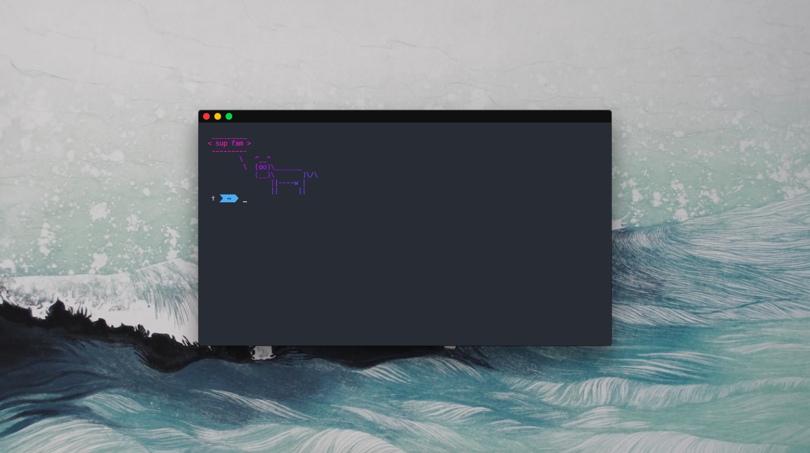

# dotfiles

<p align=center>
<a href="">

</a>
</p>
<p align=center>
    <a href=""></a>
    <a href=""></a>
    <a href=""></a>
    <a href=""></a>
</p>

> Please note that this repository is still in its early stages. The best is yet to come...

# About

The urge to create this repository has been with me for quite a while, and I have finally decided to do it after I have recieved MacBook from the company I started working for. I found myself in this awkward situation where I had to manually copy my config files from my workstation at home for git and zsh, not to mention the amount of installed apps with brew, MacAppStore etc. So I quickly gathered few files in one directory, ran `git init` and pushed it to private repository.

Fast forward to early 2018, after seeing so many great dotfile-repositories I have decided to do something with this one and improve it the best way I can.

During the development of this repository I have been highly inspired by the following gems:

- 💠 [eivindml/dotfiles](https://github.com/eivindml/dotfiles)
- 💎 [nicknisi/dotfiles](https://github.com/nicknisi/dotfiles)

... and the [r/unixporn](https://www.reddit.com/r/unixporn/)

This configuration runs on the following machines:

- 🖥 **5K iMac** `27'` `Late 2014` `4 GHz i7` `8 GB 1600 MHz DDR3` `R9 M295X`
- 💻 **MacBook Air** `13'` `Early 2015` `1.6 GHz i5` `8 GB 1600 MHz DDR3` `Intel HD 1600`

# Usage

## 👨🏻‍💻 Automated

The most convenient way of applying this configuration to your system is to simply run the attached installation script `install.sh`.

```
$ ./install.sh
```

**`[!] Caution`** This will automatically override your configuration and install all the applications listed in `/apps` directory. So for better control over what is going on I recommend the latter option.

This is basically for me only for fast updating it on my systems but if you really feel like doing it, just beware of the consequences of losing your configuration.

## 👷🏻‍ Manual

This is much more safer way for anyone trying to use these configs. So just manually copy either whole file or some parts of it to your own ones.

For apps on the other hand, just look for what you really need and then install them using brew etc.

# Contents

```
.
├── README.md
├── install.sh
├── apps
│   ├── Brewfile
│   ├── Caskfile
│   ├── Gemfile
│   ├── Masfile
│   ├── Yarnfile
│   └── apps.sh
├── defaults
│   ├── terminal.sh
│   └── wallpaper.sh
├── misc
│   ├── iterm2
│   │   └── com.googlecode.iterm2.plist
│   └── wallpaper
│       └── mimirobson.png
└── symlink
    ├── .gitconfig
    ├── .phoenix.js
    ├── .zshrc
    ├── init.vim
    └── symlink.sh
```

Obviously there is a lot to be done here. I will try to create `issue` for every major feature or task that I want to implement in the future.

# Credits

- General guidance and support on ricing award goes to my buddy [vyzyv](https://github.com/vyzyv)
- Repository structure and setup approach [eivindml](https://github.com/eivindml)
- Some gitconfigs and macOS defaults [nicknisi](https://github.com/nicknisi)
- Wallpaper by [Miranda Robson](http://www.mimirobson.tumblr.com)

✨ Thank you! ✨
