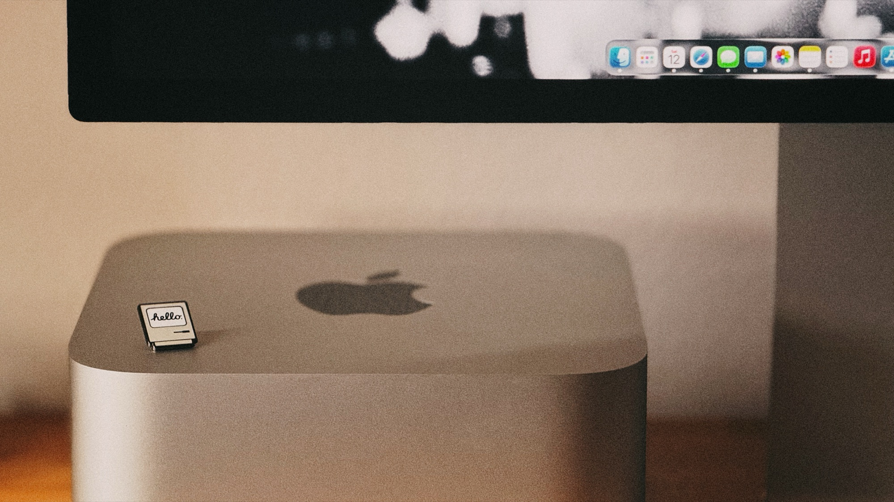

# dotfiles

<p align=center>

</p>

## About

This is the setup I build iOS apps with in 2026, kept in sync between a Mac Studio on the desk and a MacBook Air in the bag. The shell and macOS side has been here since 2018. What is new is the `agents/` directory: most of my code now goes through Claude Code and Codex, so their global instructions, settings and subagents are versioned here next to everything else, and the skills they share live in a separate [repository](https://github.com/witekbobrowski/skills). Clone both, run the install script, and either Mac ends up as the one in the photo.

This configuration runs on the following machines:

- 🖥 **Mac Studio** `M1 Ultra` `64 GB`
- 💻 **MacBook Air** `14"` `M2`

## Usage

Install [Claude Code](https://claude.com/claude-code) or [Codex](https://github.com/openai/codex), clone this repository, open a session inside it and paste:

```
Set this Mac up from these dotfiles. Clone github.com/witekbobrowski/skills
next to this repo if it is not there, run ./install.sh, fix whatever fails
along the way, and finish by checking that every symlink it creates resolves
and that both ~/.claude/skills and ~/.agents/skills list the skills.
```

The script alone works too, it just will not fix anything for you:

```
$ ./install.sh
```

It overwrites whatever config you already have, so this is really meant for my own machines. If you are someone else, copy the parts you like instead.

## Contents

```
.
├── install.sh      # runs everything below, in order
├── defaults        # macOS `defaults write` scripts
├── symlink         # dotfiles and the script that links them into $HOME
├── apps            # Homebrew, Cask, Mac App Store, gem and yarn manifests
└── agents          # Claude Code config, linked into ~/.claude
```

## Credits

Most of what is in here was learned from other people publishing their dotfiles on GitHub. Thank you, all of you. ✨
